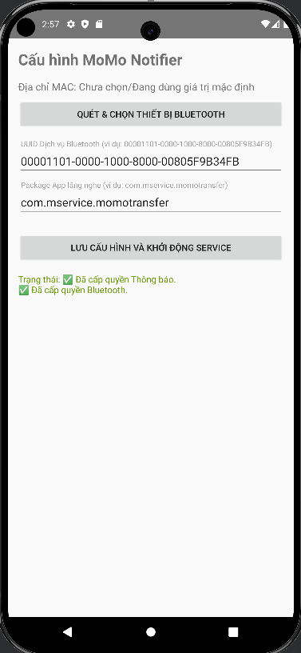
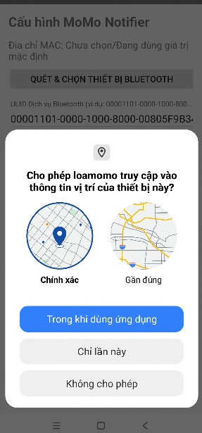
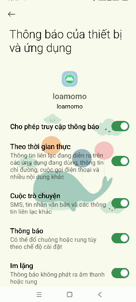
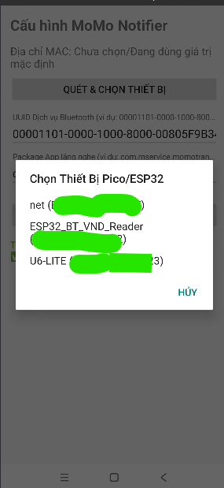
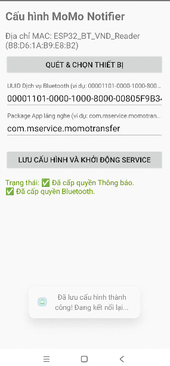

# 🔔 MoMo Notifier: Payment Notifications via Bluetooth

## Overview

This project utilizes a custom Android application to listen for payment notifications from the **MoMo app**. It then sends the notification content via **Bluetooth Classic** to an **ESP32** microcontroller. The ESP32 processes the data and plays an audible alert through an audio amplifier chip, specifically the **MAX98357A**.

---

## ✅ System Architecture (Updated)

| Component | Description | Technology |
| :--- | :--- | :--- |
| **Notification Source** | MoMo application (or any configured app) | Android Notification System |
| **Listening Application** | Custom Android App | **Kotlin, `NotificationListenerService`, Bluetooth Classic API** |
| **Receiver & Player** | Microcontroller/Processor | **ESP32**, Bluetooth Classic |
| **Audio Playback** | Class D Amplifier Chip | **MAX98357A** (or DFPlayer) |

---

## ✅ System Requirements (Yêu cầu Hệ thống)

| Cấu hình | Giá trị | Ý nghĩa |
| :--- | :--- | :--- |
| **`minSdk`** | **26** | Phiên bản Android tối thiểu được hỗ trợ (**Android 8.0, Oreo**). Các thiết bị cũ hơn sẽ không thể cài đặt ứng dụng này. |
| **`targetSdk`** | **33** | Phiên bản Android mà ứng dụng được tối ưu hóa. Ứng dụng sẽ hoạt động theo hành vi của Android 13. |
| **`compileSdk`** | **35** | Phiên bản SDK được sử dụng để biên dịch (build) dự án. |

## 🛠️ Android Application Usage Guide

The Android application is responsible for device scanning, saving the configuration, and maintaining a stable Bluetooth connection with the ESP32.

### Step 1: Grant Permissions and Enable Bluetooth

1.  **Enable Bluetooth:** Ensure that Bluetooth is turned on on your phone.
2.  **Grant Permissions:** The first time you open the app, Android will request the following permissions. Please **allow all** for scanning and connectivity to work:
    * **Bluetooth/Nearby Devices** (`BLUETOOTH_SCAN`, `BLUETOOTH_CONNECT`)
    * **Location** (Required for scanning Bluetooth devices on modern Android versions)

3.  **Grant Notification Access:** The application will direct you to the system settings. Please find your application (e.g., **`com.example.loamomo`**) and **enable Notification Access**.

### Step 2: Scan and Select the ESP32 Device

1.  On the main screen of the application, press the **"Scan & Select Bluetooth Device"** button.
2.  A dialog box will appear listing the found Bluetooth devices.

3.  **Select your ESP32/HC-05 device** (Names are typically "ESP32-BT" or "HC-05", etc.). The MAC address of the selected device will be displayed in the **"MAC Address"** field.

### Step 3: Save Configuration and Start Service

1.  **Bluetooth Service UUID:** Keep the default value (`00001101-0000-1000-8000-00805F9B34FB`) unless you have configured your ESP32 to use a different UUID.
2.  **Listening App Package:** Keep the default `com.mservice.momotransfer` to listen for MoMo notifications.
3.  Press the **"Save Config and Start Service"** button.
    * **IMPORTANT:** The app will automatically send a command to the running Service to **re-read the new configuration and immediately reconnect** the Bluetooth. You do not need to close and reopen the application.
    * The connection status will be shown on the screen.

---

## 💻 Android Source Code (Summary of Changes)

The project uses a safe and stable communication strategy between the Activity and the Service to ensure the Service updates its configuration instantly.

1.  **`MainActivity.kt` (Configuration Management & Command Sending):**
    * Implemented **Bluetooth Scanning** functionality for secure MAC selection.
    * Uses an **Intent with `ACTION_RECONNECT`** to command the Service to re-read the configuration instead of forcefully restarting the Service.

2.  **`MyNotificationListener.kt` (Service & Bluetooth Management):**
    * **Safe Initialization:** The `bluetoothAdapter` variable is initialized inside the Service's **`onCreate()`** to prevent the `UninitializedPropertyAccessException` crash.
    * **Command Handling:** The Service receives the Intent in `onStartCommand()`. If the `action` is `ACTION_RECONNECT`, it calls the **`connectWithNewConfig()`** function.
    * **Self-Update:** `connectWithNewConfig()` re-reads the configuration (MAC, UUID) from `SharedPreferences` and calls **`connectBluetoothDevice()`** to immediately re-establish the Bluetooth connection.

3.  **ESP32 (Firmware):**
    * The firmware must be programmed to listen for data strings (e.g., `so tien: 300 d`) via **Bluetooth Serial**.
    * It uses the **MAX98357A/I2S** library to play the corresponding audio file based on the received amount.
